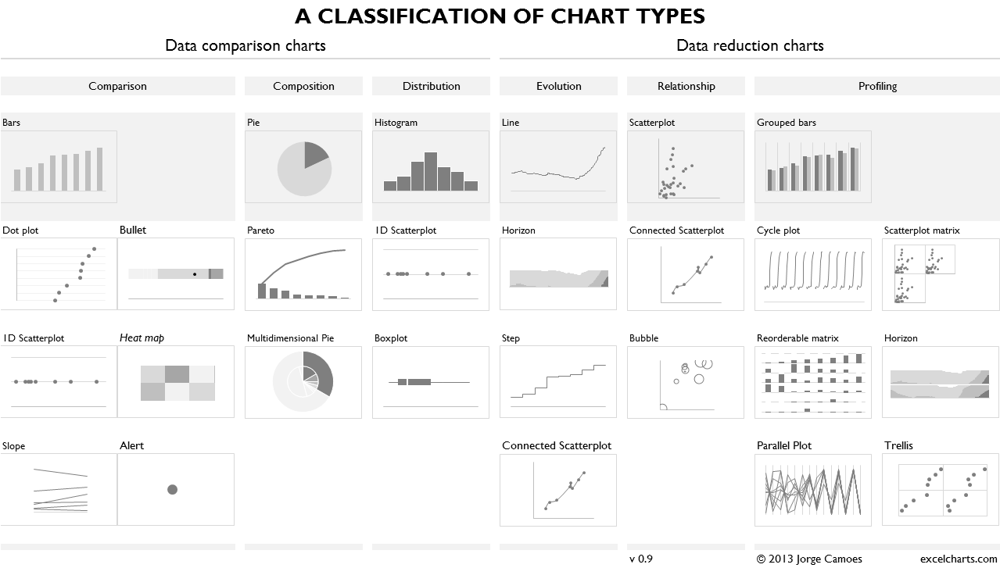

# Taller de Visual Analytics

Juan Camilo González Jiménez

Profesor, [Centro de Estudios en Periodismo](https://ceper.uniandes.edu.co/miembro/juan-camilo-gonzalez/ "Perfil en sitio de Uniandes")

Director del [Laboratorio EnFlujo](https://enflujo.com "Ir al sitio del Laboratorio EnFlujo")

Universidad de los Andes

"Visual Analytics" es otra forma de decir: Narrar las potencias o hallazgos en unos datos, haciendo uso de gráficas y texto.

- Son pequeños cuentos.
- Cuentos que emocionan al espectador.
- Cuentos que llaman la atención
- En el mejor de los casos invitan al espectador a querer saber más.

## ¿Qué vamos a aprender?

1. ¿A quien le estamos hablando? [modos de narrar](./modos-de-narrar.md)
2. Unos conceptos que van a guiar nuestro trabajo durante el taller:
   1. [Modos de atención frente a una gráfica.](./preatencion.md)
   2. [Sistemas de visualización dependiendo de nuestros datos.](#ayuda-para-saber-que-gráfica-usar-según-mis-datos)
   3. [Formas de usar el color para representar datos o para decorar.](#color)
3. Nombrar las gráficas no son simplemente títulos, el uso del texto en complemento a las gráficas.

## Recursos

Les dejo algunos recursos que les pueden servir en su trabajo.

### Ayuda para saber que gráfica usar según mis datos

En estos sitios encuentran guías para elegir el tipo de gráfica de manera visual o interactiva:

- https://www.data-to-viz.com/
- https://ft-interactive.github.io/visual-vocabulary/
- https://chart.guide/charts/chart-choosing/

Estos se enfocan en aquellas gráficas disponibles en Excel propiamente y nos sirven para hacer análisis rápidos en una aplicación que probablemente usamos con regularidad:

- https://www.juiceanalytics.com/chartchooser
- http://excelcharts.com/classification-chart-types/

### Color

Una guía que explica los conceptos que vamos a analizar: [https://spectrum.adobe.com/page/color-for-data-visualization/](https://spectrum.adobe.com/page/color-for-data-visualization/)

- [Color Picker for Data](https://tristen.ca/hcl-picker/#/hlc/6/1/15534C/E2E062): Herramienta intuitiva para generar paletas de colores específicamente para visualización de datos.
- [Chroma.js Color Palette Helper](https://www.vis4.net/palettes/#/9|s|00429d,96ffea,ffffe0|ffffe0,ff005e,93003a|1|1): Herramienta para crear paletas de colores. Permite seleccionar modo categórico o divergente, lo cual es una gran ayuda.
- [Color Brewer](https://colorbrewer2.org/#type=sequential&scheme=BuGn&n=3): Herramienta para crear paletas de colores en mapas.
- [Color Blind Simulator](https://www.color-blindness.com/coblis-color-blindness-simulator/): Excelente herramienta para revisar si su paleta de colores puede tener problemas en poblaciones con discapacidad. Pueden tomar un pantallazo de sus visualizaciones y subir la foto a la plataforma para que la vean en diferentes modos de capacidad visual.
- [Colors in Action](https://projects.susielu.com/viz-palette): Si tienen definida una paleta de colores, esta herramienta les puede ayudar a verla aplicada en diferentes tipos de visualizaciones antes de hacer las suyas.
