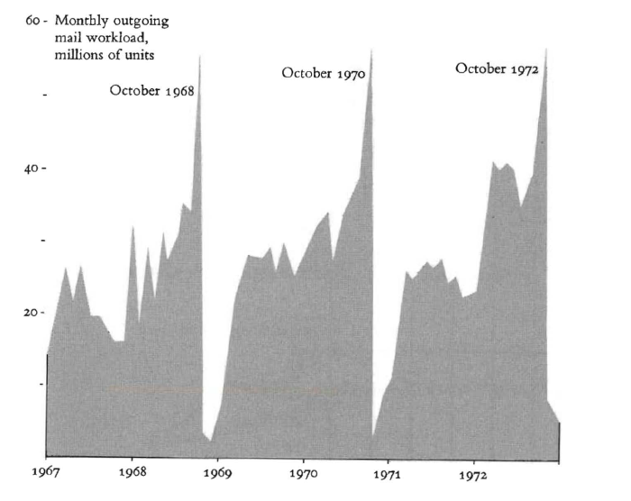

# Narrar con gráficas

Menos es más, gráficas que hacen uso elocuente de buenas prácticas.

> Extraido de "Graphical Excellence" p.37, Edward Tufte

> Mapa Fantasma, epidemia de cólera en Londres, 1854 – John Snow.

A veces toca buscar formas que no existen para hacerle justicia a nuestras historias

> Charles Joseph Minard, Tableaux Graphiques et Carles Figuratives de M. Minard, 1845-1869,

> Florence Nightingale, “Coxcomb” (1858)